# TEAM DESTATIS: Repository for work on the UNECE HLG-MOS Synthetic Data Challenge 

This was our (**Team DESTATIS**) repository for work on the United Nations Economic Commission for Europe (UNECE) High-level Group for the Modernisation of Statistical Production and Services (HLG-MOS) **Synthetic Data Challenge 2022**. 

## Background

The HLG-MOS Synthetical Data Challenge was all about exploring different methods, algorithms, metrics and utilities to create synthetic data. Synthetic Data could potentially be an interesting option for national statistical agencies to share data while maintaining public trust. 

In order to be beneficial for certain use cases (e.g. 'release data to the public', 'release to trusted researchers', 'usage in education') the synthetic data needs to conserve certain statistical properties of the data. Thus, the synthetic data needs to be similar to the original data, but at the same time it has to be different to preserve privacy. 

There is a lot of active research done on synthetic data and new methods for generating and evaluating confidentiality of synthetic data are emerging. The HLG-MOS has created a [Synthetic Data Starter Guide](https://statswiki.unece.org/download/attachments/330367757/Synthetic%20Data%20for%20NSOs%20A%20starter%20guide.pdf?api=v2) to give national statistic offices an intro into this topic. 

*Figure 1: Results example Correlation Plot showing differences in correlations between a GAN created synthetic dataset and the original data*

# Goal 

Goal of the challenge was to create synthetic versions of provided datasets and afterwards evaluate to what extent we would use this synthetic data for certain use cases. These use-cases were 'Releasing microdata to the public', 'Testing analysis', 'Education', 'Testing technology'.

One objective thereby was to evaluate as many different methods as possibly, while still trying to optimze parameters for the methods as good as possible.

Our team managed to create synthetic data with the following methods:

 - Fully Conditional Specification (FCS)
 - Generative Adversarial Network (GAN)
 - Probabilistic Graphical Models(Minutemen DP-pgm)
 - Information Preserving Statistical Obfuscation(IPSO)
 - Multivariate non-normal distribution (Simulated)

The other objective was to do this evaluation ideally for both of the provided original datasets. One dataset (SATGPA) being more of a toy example and the other (ACS) a more complex real-life dataset.

  - [SATGPA](https://www.openintro.org/data/index.php?data=satgpa): SAT (United States Standardized university Admissions Test) and GPA (university Grade Point Average) data, 6 features, 1.000 observations. 
  
 - [ACS](https://github.com/usnistgov/SDNist/tree/main/sdnist/census_public_data): Demographic survey data (American Community Survey), 33 features, 1.035.201 observations. 

So overall, it was about trying as many methods as possible, while still doing a quality evaluation (in terms of privacy and usability metrics) for each created synthetic dataset.

**Final deliverables were**: 

A short 5 minute summary **video**, synthetic **datasets**, evaluation **reports** and an evaluation of the starter guide.

*Figure 2: Results example histogram showing differences in distributions between a GAN created synthetic dataset and the original data*

# Team
Our team of the Federal Statistical Office of Germany (Statistisches Bundesamt) consited from five members of different groups within Destatis. Participating were:

 - Steffen M.
 - Reinhard T.
 - Felix G.
 - Michel R.
 - Hariolf M.
 
 

## Repository Structure
Since it was a challenge in limited time and we were working in parallel the Github repository might look a little bit untidy. There are plenty of interesting things to find in the repository, here is a quick orientation:

- [All 0_ files: Overview Presentation abour our challenge work](0_Final_Slides_DESTATIS.pdf) 
- [All 1_ files: All our final synthetic datasets and multiple evaluation reports](/1_Final_Reports_and_Results) 
- [All 2_ files: Different folders with .Rmd files to create the evalation reports for the synthetic datasets ](/2_Evaluation_ACS_FCS) 
- [All 3_ files: Mainly intermediate datasets created from using minutemen](/3_minuteman_acs) 
- [All 4_ files: Saved cgan models](/4_models)
- [All 5_ files: Different resulting synthetic datasets](5_results)
- [All 6_ files: .Rmd files used to run python code for GANs](https://github.com/SteffenMoritz/Synthetic_Data_Challenge)
- [All 7_ files: Different .R files for running algorithms to create synthetic data](https://github.com/SteffenMoritz/Synthetic_Data_Challenge)
- [All other files: Mainly different other .R code files, original datasets, samples of original datasets ](https://github.com/SteffenMoritz/Synthetic_Data_Challenge)

Some larger files >100MB of our repo are unfortunately not linked, because of the max. Github file size allowed in the free tier.

## Results

We ended up on **2nd place** in the challenge leaderboard (which mostly expressed, how many methods a team successfully used to create and evaluate synthetic datasets). It might be interesting to look at our final overview [slides](0_Final_Slides_DESTATIS.pdf). 

Here is also a quick overview about some resulting metrics for the different methods:

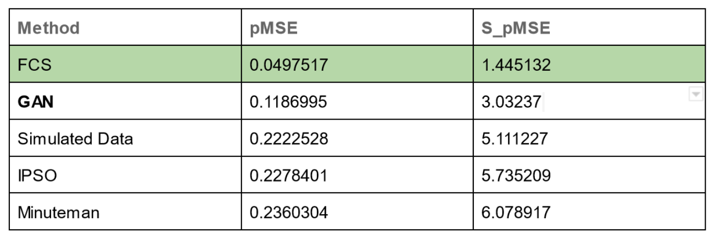

*Figure 3: Some of the utility metrics calculated for the created synthetic versions of the SATGAP dataset*

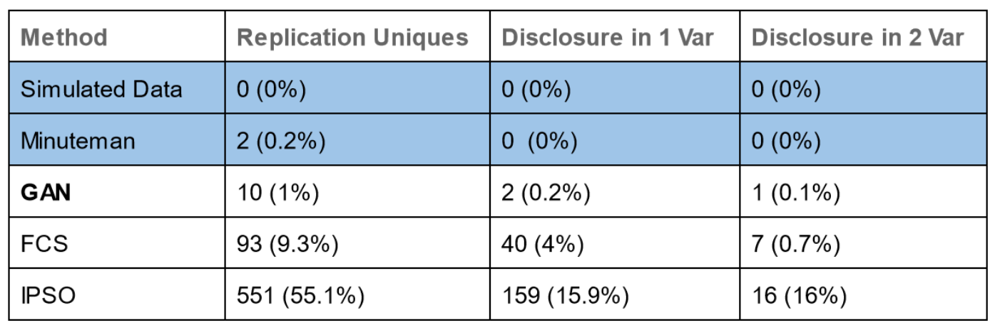

*Figure 4: Some of the privacy metrics calculated for the created synthetic versions of the SATGAP dataset*

But, one **key takeaway** from this challenge is: **One or two metrics are not able to tell the whole story**. Some datasets showed e.g.really good usability results according to the pMSE metric, but the usability according to histogram comparisons was terrible. That is why in order to evaluate each method / created synthetic datasets we had to compile quite large reports using several different metrics.

These reports [SATGPA-FCS](1_Final_Reports_and_Results/1. Evaluation SATGPA - Fully Conditional Specification (FCS).pdf), [SATGPA-GAN](1_Final_Reports_and_Results/2. Evaluation SATGPA - Generative Adversarial Network (GAN).pdf), [SATGPA-PGM](1_Final_Reports_and_Results/3. Evaluation SATGPA - Probabilistic Graphical Models (Minutemen DP-pgm).pdf), [SATGPA-IPSO](1_Final_Reports_and_Results/4. Evaluation SATGPA - Information Preserving Statistical Obfuscation (IPSO).pdf), [SATGPA-SIM](1_Final_Reports_and_Results/5. Evaluation SATGPA - Simulated Data (multivariate non-normal distribution).pdf), [ACS-FCS](1_Final_Reports_and_Results/6. Evaluation ACS - Fully Conditional Specification (FCS).pdf), [ACS-GAN](1_Final_Reports_and_Results/7. Evaluation ACS - Generative Adversarial Network (GAN).pdf), [ACS-PGM](1_Final_Reports_and_Results/8. Evaluation ACS - Probabilistic Graphical Models (Minutemen DP-pgm).pdf), [ACS-IPSO](1_Final_Reports_and_Results/9. Evaluation ACS - Information Preserving Statistical Obfuscation (IPSO).pdf), [ACS-SIM](1_Final_Reports_and_Results/10. Evaluation ACS - Simulation Models (multivariate normal distribution).pdf) (together with the datasets itself) were the main results.

To end this already quite lengthy Readme.md file - here is the **SATGPA-GAN report** as an report example:

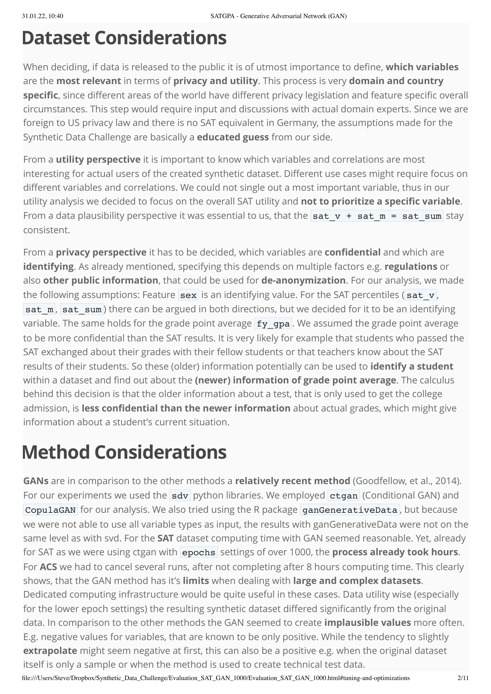

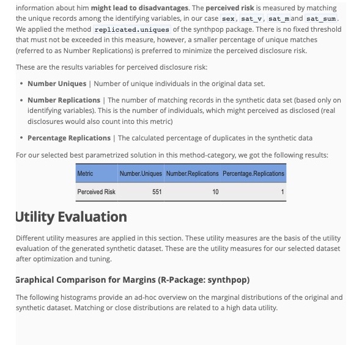

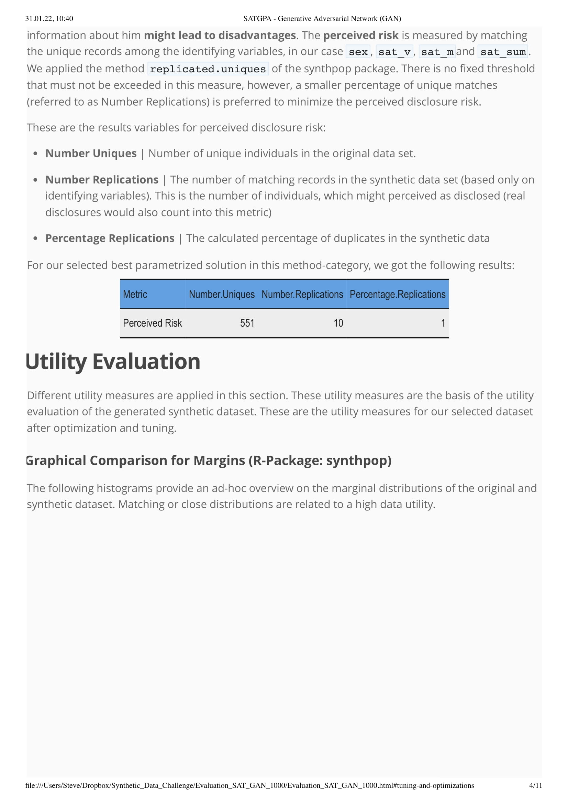

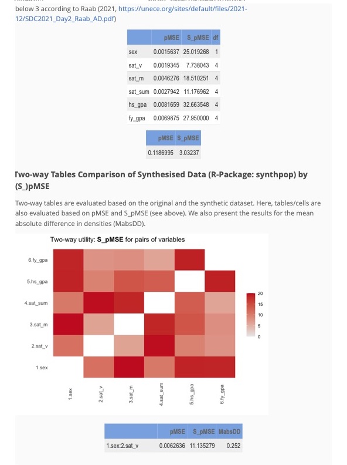

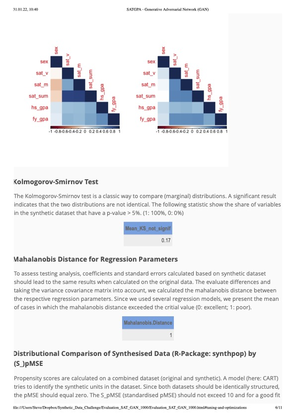

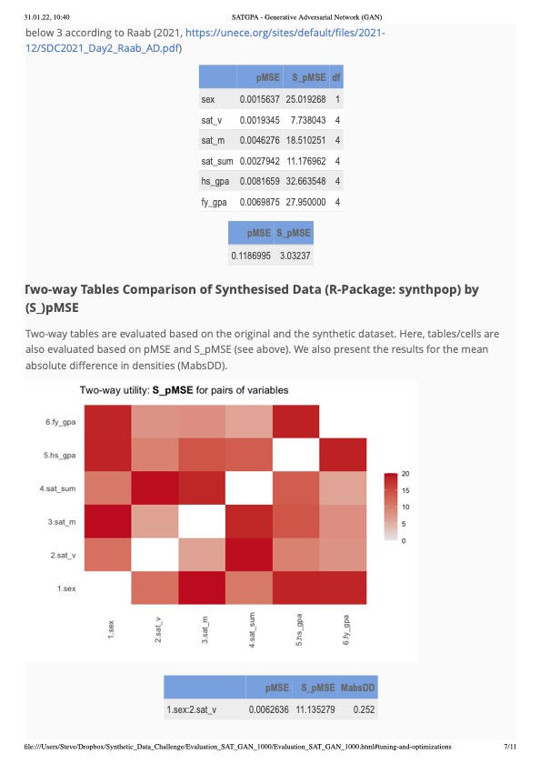

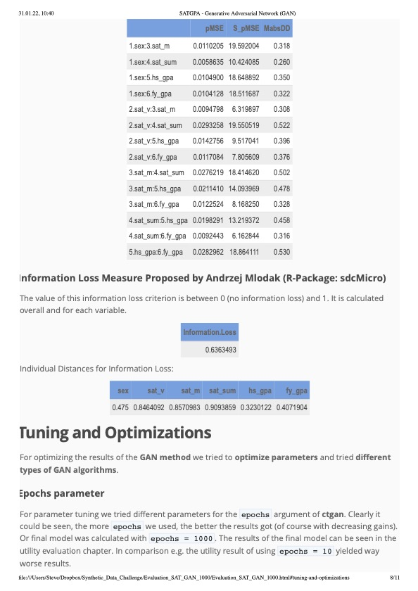

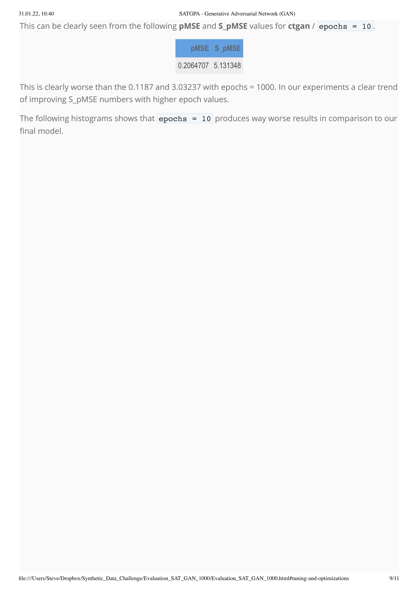

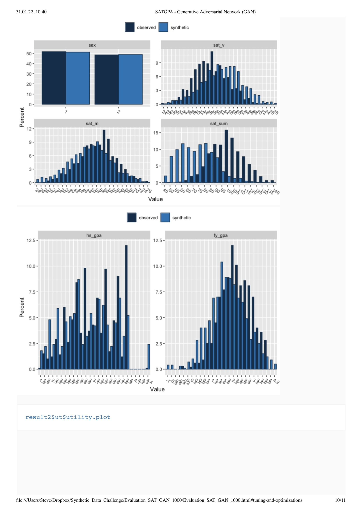

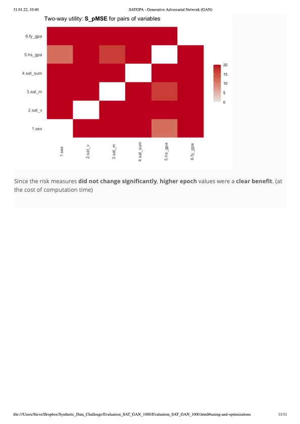

